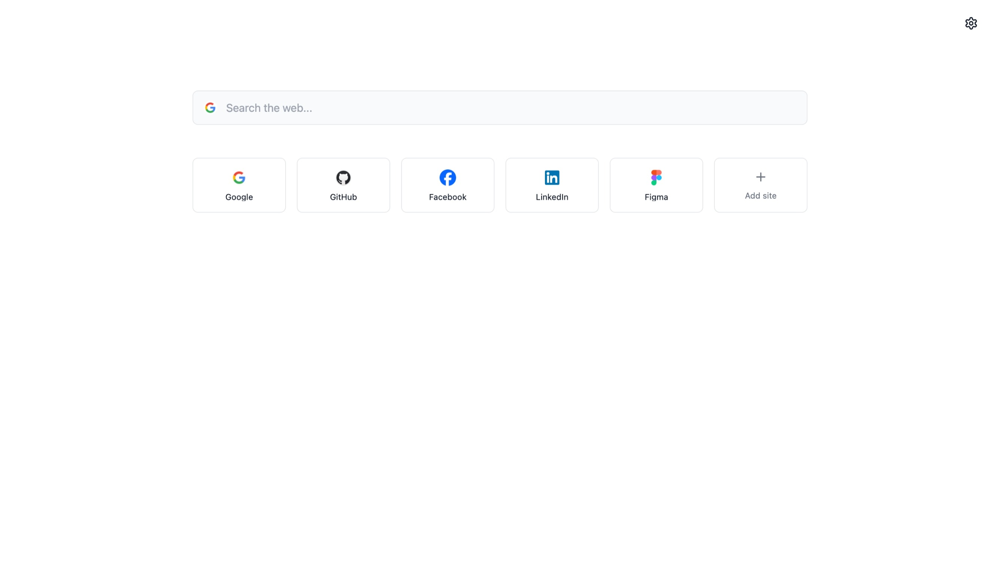
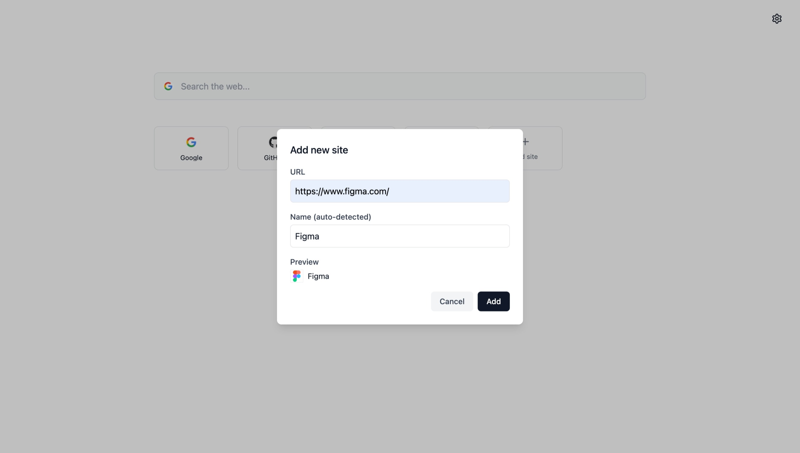
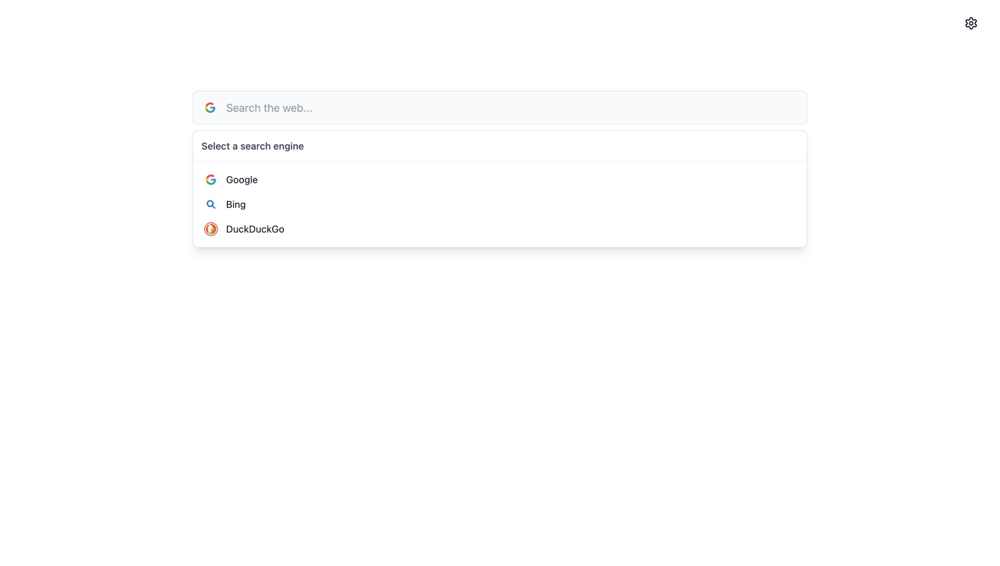
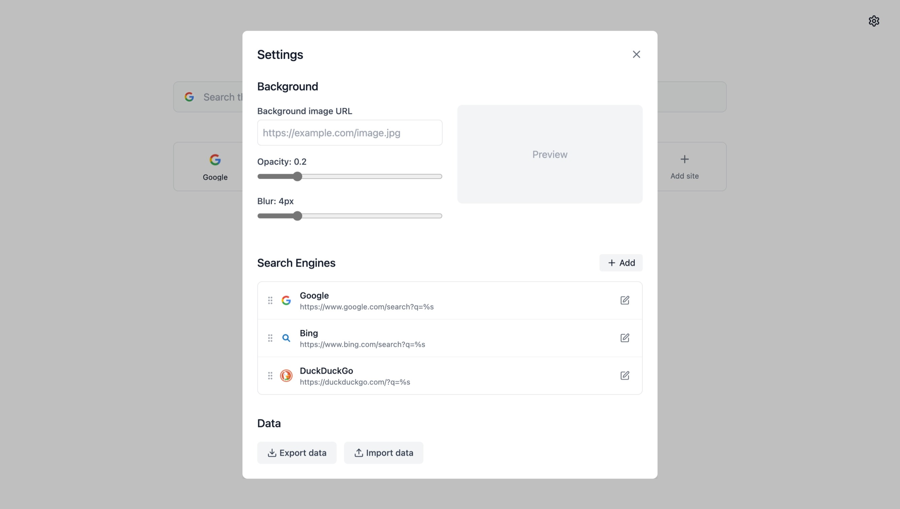

# navsite
Website navigation for new tab page.
Supports adding favorite websites, search engines, and changing the background image.
Preview：

Demo：https://nav.riiio.top/
The demo is for trial purposes only. The project is under the MIT license, so you are free to deploy and use it yourself.
